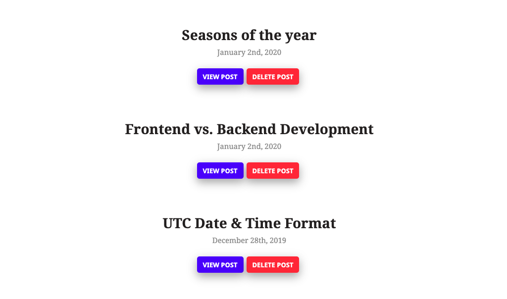
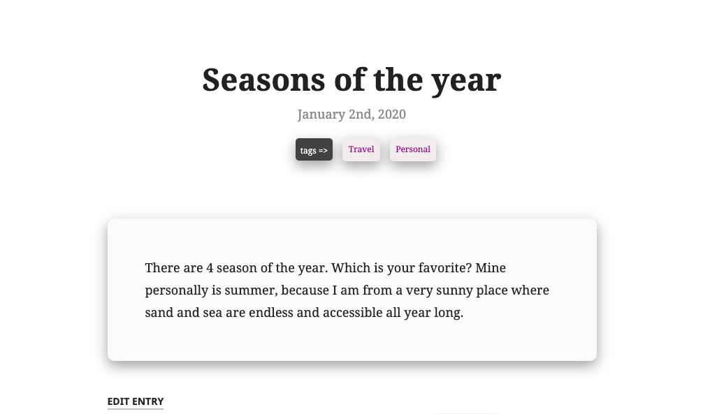
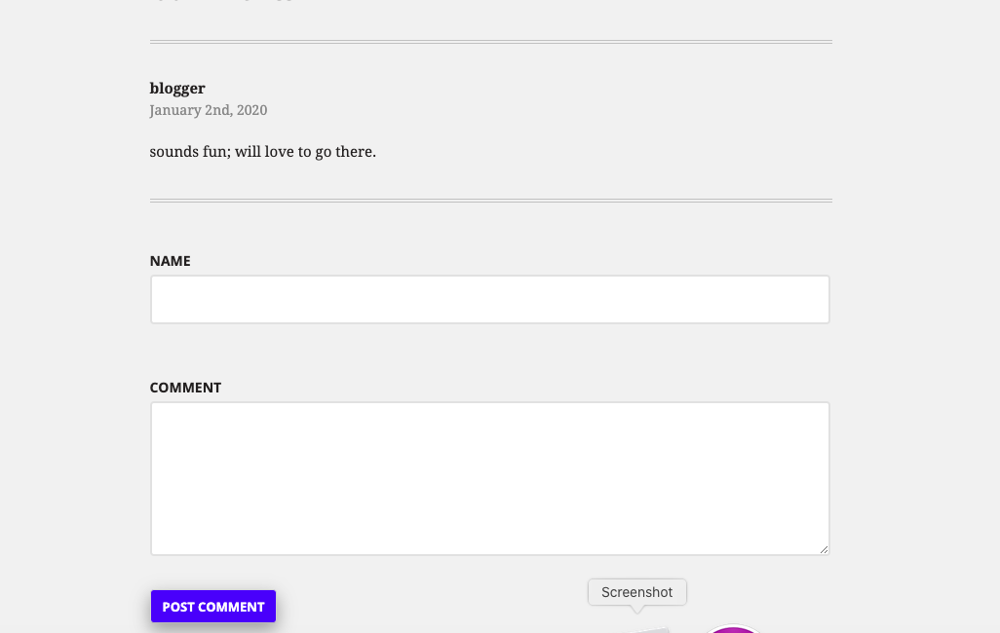

# Project #5
TAP - Project #5 ~ Personal blog using slim micro framework


## About Project
This project uses the slim micro framework, the twig template engine and sqlite to create a personal blog.


## Features
**New post**: A new post may be added using the pencil icon located near the upper right side while on the home page, an individual post page, as well as in the edit entry mode.

**Edit & update post**: To edit a post, simply click on the title of the post or the view post button under the name of post and near hte bottom of the post, select edit entry. 

**Delete post**: A post can deleted by using the delete butotn under the name of the post while on the home page or by clicking on the specific post and then clicking on the delete button at the bottom of the post page. 

**Comments**: A visitor to the site may add any number of comments to a post.


## View & Interact With Project
1. Download and unzip the project folder
2.  Run ```compser install``` to install the project dependencies
3. Use a tool like MAMP and point to the index.php inside of the public folder and then start your server
4. Visit *localhost:[PORT_NUM]* prelacing [PORT_NUM] with the apppropriate port number configured on your php server, to view and interact with the blog


## Screenshots
 
 
 


